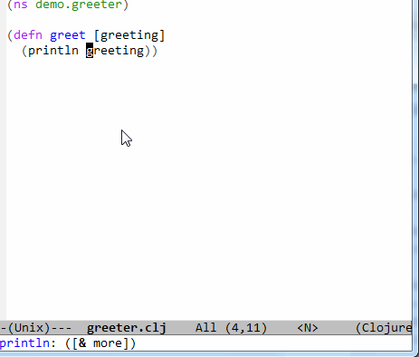

[](http://melpa.org/#/clj-refactor)
[](http://stable.melpa.org/#/clj-refactor)
[](http://travis-ci.org/clojure-emacs/clj-refactor.el)
[](https://gitter.im/clojure-emacs/refactor-nrepl?utm_source=badge&utm_medium=badge&utm_campaign=pr-badge)

# clj-refactor.el

`clj-refactor` provides refactoring support for clojure projects.

Here's a small teaser, helping you add a missing libspec:



## Installation

I highly recommend installing clj-refactor through elpa.

It's available on [melpa](http://melpa.org/) and [melpa-stable](http://stable.melpa.org/):

    M-x package-install clj-refactor

## Setup

```el
(require 'clj-refactor)

(defun my-clojure-mode-hook ()
    (clj-refactor-mode 1)
    (yas-minor-mode 1) ; for adding require/use/import
    (cljr-add-keybindings-with-prefix "C-c C-m"))

(add-hook 'clojure-mode-hook #'my-clojure-mode-hook)
```

The more advanced refactorings require our nREPL middleware [refactor-nrepl](https://github.com/clojure-emacs/refactor-nrepl).

To install it add the following, either in your project's `project.clj` or in the `:user`
profile found at `~/.lein/profiles.clj`:

```clojure
:plugins [[refactor-nrepl "1.1.0"]
          [cider/cider-nrepl "0.9.1"]]
```

That's it!

Check out the much longer [installation](https://github.com/clojure-emacs/clj-refactor.el/wiki/installation) page in the wiki for a less opinionated approach.

cljr-refactor has quite a few settings you can tweak to change the
behavior of various commands.  You can read more about that
[here](https://github.com/clojure-emacs/clj-refactor.el/wiki#customization).

## Usage

All functions in clj-refactor have a two-letter mnemonic shortcut. E.g. `rs` for `cljr-rename-symbol`.  Given the prefix choice in the example setup you'd call this function by hitting `C-c C-m rs`

See the wiki for a complete [list of available refactorings] (https://github.com/clojure-emacs/clj-refactor.el/wiki), demonstrations and customization points.

If you're having trouble remembering the mnenmic shortcuts, check out
the [hydra](https://github.com/abo-abo/hydra) powered popup menus.
They are described
[here](https://github.com/clojure-emacs/clj-refactor.el/wiki/hydra-parent).

## Changelog

An extensive changelog is available [here](CHANGELOG.md).

## Contribute

Yes, please do. There's a suite of tests, so remember to add tests for
your specific feature, or we might break it later.

You'll find the repo at:

    https://github.com/clojure-emacs/clj-refactor.el

To fetch the test dependencies, install
[cask](https://github.com/cask/cask) if you haven't already,
then:

    $ cd /path/to/clj-refactor
    $ cask

Run the tests with:

    $ ./run-tests.sh


Before submitting a patch, or a pull request, make sure all tests are
passing and that your patch is in line with the [contribution
guidelines](CONTRIBUTING.md).

Thanks to [everyone](https://github.com/clojure-emacs/clj-refactor.el/graphs/contributors) who's contributed so far!

## License

Copyright © 2012-2015 Magnar Sveen
Copyright © 2014-2015 Magnar Sveen, Lars Andersen, Benedek Fazekas

Author: Magnar Sveen <magnars@gmail.com>
        Lars Andersen <expez@expez.com>
        Benedek Fazekas
Keywords: convenience, clojure, cider

This program is free software; you can redistribute it and/or modify
it under the terms of the GNU General Public License as published by
the Free Software Foundation, either version 3 of the License, or
(at your option) any later version.

This program is distributed in the hope that it will be useful,
but WITHOUT ANY WARRANTY; without even the implied warranty of
MERCHANTABILITY or FITNESS FOR A PARTICULAR PURPOSE.  See the
GNU General Public License for more details.

You should have received a copy of the GNU General Public License
along with this program.  If not, see <http://www.gnu.org/licenses/>.
